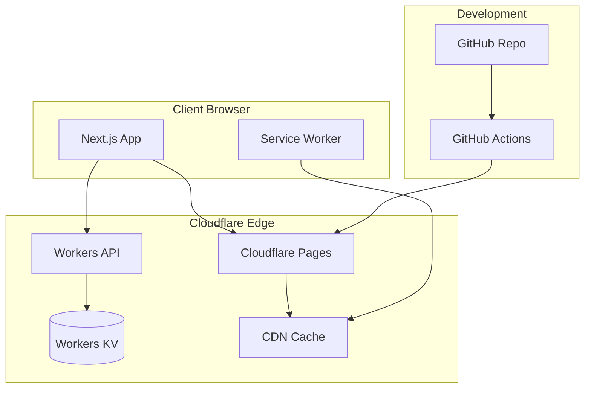
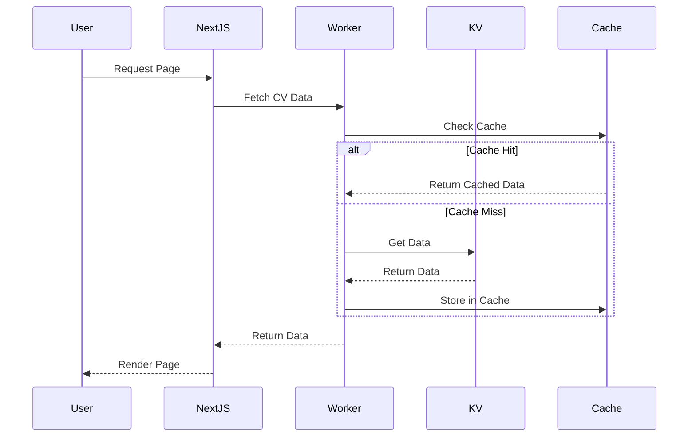
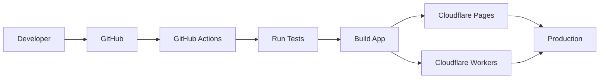

# System Architecture

## CV Website Technical Design

### Document Version

- **Version**: 1.0
- **Date**: August 3, 2025
- **Purpose**: Define system architecture and data flow
- **Stack**: Next.js + Cloudflare (Free Tier)

---

## 1. High-Level Architecture



### 1.1 Architecture Principles

- **Edge-First**: Leverage Cloudflare's global network
- **Static When Possible**: Pre-render for performance
- **Dynamic Data**: API-driven personal information
- **Progressive Enhancement**: Works without JavaScript
- **Resilient**: Graceful degradation

### 1.2 Technology Stack

```yaml
Frontend:
  - Framework: Next.js 15 (App Router)
  - Language: TypeScript 5.x
  - Styling: Tailwind CSS v4
  - Animation: Framer Motion
  - Icons: Lucide React

Backend:
  - API: Cloudflare Workers
  - Database: Workers KV
  - Cache: Cloudflare CDN
  - Domain: Cloudflare DNS

DevOps:
  - CI/CD: GitHub Actions
  - Hosting: Cloudflare Pages
  - Monitoring: Cloudflare Analytics
  - Secrets: GitHub Secrets + Wrangler
```

---

## 2. Component Architecture

### 2.1 Directory Structure

```text
cv-arnold-website/
├── src/
│   ├── app/                    # Next.js App Router
│   │   ├── layout.tsx         # Root layout
│   │   ├── page.tsx           # Home page
│   │   ├── admin/             # Admin routes
│   │   └── api/               # API routes (if needed)
│   ├── components/
│   │   ├── base/              # Atomic components
│   │   ├── layout/            # Layout components
│   │   ├── sections/          # Page sections
│   │   └── features/          # Feature components
│   ├── design-system/
│   │   ├── tokens/            # Design tokens
│   │   ├── themes/            # Theme definitions
│   │   └── utils/             # Style utilities
│   ├── hooks/                 # Custom React hooks
│   ├── lib/                   # Utilities
│   │   ├── api/              # API client
│   │   ├── analytics/        # Analytics
│   │   └── utils/            # Helpers
│   ├── types/                # TypeScript types
│   └── styles/               # Global styles
├── workers/                   # Cloudflare Workers
│   ├── api/                  # API worker
│   └── scripts/              # Worker scripts
├── public/                   # Static assets
├── tests/                    # Test files
└── infrastructure/           # IaC configs
```

### 2.2 Component Hierarchy

```typescript
// Component dependency graph
App
├── Layout
│   ├── Header
│   │   ├── Navigation
│   │   ├── ThemeSwitcher
│   │   └── MobileMenu
│   └── Footer
├── HomePage
│   ├── HeroSection
│   │   ├── PersonalInfo
│   │   ├── Achievements
│   │   └── CTAButtons
│   ├── ExperienceSection
│   │   └── ExperienceCard[]
│   ├── SkillsSection
│   │   └── SkillCategory[]
│   ├── CertificationsSection
│   │   └── CertificationCard[]
│   └── ContactSection
│       └── ContactForm
└── AdminPage
    ├── DataEditor
    └── Preview
```

---

## 3. Data Architecture

### 3.1 Data Flow



### 3.2 Data Schema

```typescript
// Main data structure in KV
interface CVDataStore {
  version: string
  lastUpdated: string
  data: CVData
  draft?: CVData // For preview
}

interface CVData {
  personalInfo: {
    name: string
    title: string
    email: string
    phone: string
    location: string
    linkedin: string
    github?: string
  }

  summary: string

  experience: Array<{
    id: string
    company: string
    position: string
    startDate: string
    endDate: string
    location: string
    responsibilities: string[]
    achievements: string[]
    technologies: string[]
  }>

  skills: Array<{
    category: string
    items: Array<{
      name: string
      proficiency: number // 1-10
    }>
  }>

  certifications: Array<{
    name: string
    issuer: string
    date: string
    credentialId?: string
    verificationUrl?: string
  }>

  achievements: Array<{
    title: string
    description: string
    impact: string
    icon: string
  }>

  education: Array<{
    institution: string
    degree: string
    period: string
  }>

  languages: Array<{
    language: string
    proficiency: string
  }>
}
```

### 3.3 KV Storage Strategy

```typescript
// KV namespace structure
{
  "cv-data:current": CVDataStore,      // Current live data
  "cv-data:draft": CVDataStore,        // Draft for preview
  "cv-data:backup:2025-08-03": CVDataStore,  // Backups
  "cv-data:version": "1.0.0",         // Version tracking
  "cv-data:metadata": {               // Metadata
    "lastUpdated": "2025-08-03T10:00:00Z",
    "updateCount": 42
  }
}
```

---

## 4. API Design

### 4.1 Cloudflare Workers Endpoints

```typescript
// Base URL: https://api.cv.arnoldcartagena.com

// Public endpoints
GET  /cv-data                 // Get all CV data
GET  /cv-data/section/:name   // Get specific section
GET  /health                  // Health check
GET  /version                 // API version

// Protected endpoints (require auth)
PUT  /cv-data                 // Update all data
PUT  /cv-data/section/:name   // Update section
POST /cv-data/preview         // Save draft
POST /cv-data/publish         // Publish draft
GET  /cv-data/history         // Get update history
```

### 4.2 API Response Format

```typescript
// Success response
{
  "success": true,
  "data": T,
  "meta": {
    "version": "1.0.0",
    "timestamp": "2025-08-03T10:00:00Z",
    "cached": false
  }
}

// Error response
{
  "success": false,
  "error": {
    "code": "RATE_LIMITED",
    "message": "Too many requests",
    "details": {}
  },
  "meta": {
    "timestamp": "2025-08-03T10:00:00Z"
  }
}
```

### 4.3 Authentication Strategy

```typescript
// Simple bearer token for admin operations
// Token stored in environment variables

const AUTH_TOKEN = env.ADMIN_AUTH_TOKEN

async function authenticate(request: Request): Promise<boolean> {
  const auth = request.headers.get('Authorization')
  return auth === `Bearer ${AUTH_TOKEN}`
}
```

---

## 5. Caching Strategy

### 5.1 Cache Layers

```yaml
Browser Cache:
  - Static assets: 1 year
  - HTML pages: 0 (always revalidate)
  - API responses: 5 minutes

CDN Cache:
  - Static assets: 1 year
  - HTML pages: 5 minutes
  - API responses: 5 minutes

Worker Cache:
  - KV data: 5 minutes
  - Computed data: 1 hour

KV Cache:
  - Read cache: Automatic
  - Write through: Immediate
```

### 5.2 Cache Implementation

```typescript
// Worker caching example
const CACHE_KEY = 'cv-data:cache'
const CACHE_TTL = 300 // 5 minutes

async function getCVData(env: Env): Promise<CVData> {
  // Try cache first
  const cache = caches.default
  const cacheKey = new Request(CACHE_KEY)
  const cached = await cache.match(cacheKey)

  if (cached) {
    return await cached.json()
  }

  // Fetch from KV
  const data = await env.KV.get('cv-data:current', 'json')

  // Cache the response
  const response = new Response(JSON.stringify(data), {
    headers: {
      'Cache-Control': `public, max-age=${CACHE_TTL}`,
      'Content-Type': 'application/json',
    },
  })

  await cache.put(cacheKey, response.clone())
  return data
}
```

---

## 6. State Management

### 6.1 Client State Architecture

```typescript
// State hierarchy
App State
├── Theme State (Context)
│   ├── Current Theme
│   └── System Preference
├── Navigation State (Context)
│   ├── Active Section
│   └── Scroll Position
├── UI State (Local)
│   ├── Menu Open
│   ├── Modal State
│   └── Loading States
└── Server State (React Query/SWR)
    ├── CV Data
    ├── Analytics
    └── Admin State
```

### 6.2 State Management Patterns

```typescript
// Theme Context
interface ThemeContextType {
  theme: 'light' | 'dark' | 'system'
  setTheme: (theme: Theme) => void
  resolvedTheme: 'light' | 'dark'
}

// Navigation Context
interface NavigationContextType {
  activeSection: string
  scrollDirection: 'up' | 'down'
  isAtTop: boolean
}

// Data fetching with SWR
function useCVData() {
  return useSWR('/api/cv-data', fetcher, {
    revalidateOnFocus: false,
    revalidateOnReconnect: false,
    refreshInterval: 300000, // 5 minutes
  })
}
```

---

## 7. Performance Architecture

### 7.1 Optimization Strategy

```yaml
Build Time:
  - Static generation for pages
  - Image optimization
  - Code splitting
  - Tree shaking

Runtime:
  - Lazy loading sections
  - Progressive images
  - Font optimization
  - Animation throttling

Network:
  - HTTP/3 via Cloudflare
  - Brotli compression
  - Resource hints
  - Service worker
```

### 7.2 Bundle Strategy

```javascript
// Next.js config for optimization
module.exports = {
  experimental: {
    optimizeCss: true,
    optimizePackageImports: ['framer-motion', 'lucide-react'],
  },

  images: {
    formats: ['image/avif', 'image/webp'],
    minimumCacheTTL: 31536000,
  },

  compiler: {
    removeConsole: process.env.NODE_ENV === 'production',
  },
}
```

### 7.3 Critical Path Optimization

```html
<!-- Preload critical resources -->
<link rel="preconnect" href="https://api.cv.arnoldcartagena.com" />
<link rel="dns-prefetch" href="https://cdn.cloudflare.com" />
<link rel="preload" href="/fonts/inter.woff2" as="font" crossorigin />

<!-- Inline critical CSS -->
<style>
  /* Critical above-fold styles */
</style>
```

---

## 8. Security Architecture

### 8.1 Security Headers

```typescript
// Cloudflare Worker security headers
const SECURITY_HEADERS = {
  'Content-Security-Policy':
    "default-src 'self'; script-src 'self' 'unsafe-inline' 'unsafe-eval'; style-src 'self' 'unsafe-inline'",
  'X-Content-Type-Options': 'nosniff',
  'X-Frame-Options': 'DENY',
  'X-XSS-Protection': '1; mode=block',
  'Referrer-Policy': 'strict-origin-when-cross-origin',
  'Permissions-Policy': 'camera=(), microphone=(), geolocation=()',
}
```

### 8.2 API Security

```typescript
// Rate limiting implementation
const RATE_LIMIT = {
  windowMs: 15 * 60 * 1000, // 15 minutes
  max: 100, // requests per window
}

// CORS configuration
const CORS_HEADERS = {
  'Access-Control-Allow-Origin': 'https://cv.arnoldcartagena.com',
  'Access-Control-Allow-Methods': 'GET, PUT, POST, OPTIONS',
  'Access-Control-Allow-Headers': 'Content-Type, Authorization',
  'Access-Control-Max-Age': '86400',
}
```

---

## 9. Deployment Architecture

### 9.1 CI/CD Pipeline



### 9.2 Environment Configuration

```yaml
Development:
  - Local Next.js dev server
  - Miniflare for Workers
  - Local KV namespace

Staging:
  - Preview deployments
  - Staging KV namespace
  - Feature flags enabled

Production:
  - Cloudflare Pages
  - Production Workers
  - Production KV
  - Analytics enabled
```

---

## 10. Monitoring & Observability

### 10.1 Metrics Collection

```typescript
// Key metrics to track
interface Metrics {
  // Performance
  pageLoadTime: number
  ttfb: number
  fcp: number
  lcp: number

  // Business
  visits: number
  cvDownloads: number
  contactSubmissions: number

  // Technical
  apiLatency: number
  errorRate: number
  cacheHitRate: number
}
```

### 10.2 Error Handling

```typescript
// Global error boundary
class ErrorBoundary extends React.Component {
  componentDidCatch(error: Error, errorInfo: ErrorInfo) {
    // Log to analytics
    analytics.track('error', {
      message: error.message,
      stack: error.stack,
      componentStack: errorInfo.componentStack,
    })
  }
}

// Worker error handling
addEventListener('fetch', event => {
  event.respondWith(
    handleRequest(event.request).catch(err => {
      // Log error
      console.error('Worker error:', err)

      // Return fallback response
      return new Response('Internal Server Error', {
        status: 500,
      })
    })
  )
})
```

---

## 11. Scalability Considerations

### 11.1 Traffic Handling

- **CDN**: Unlimited bandwidth via Cloudflare
- **Workers**: 100k requests/day (free tier)
- **KV**: 100k reads/day, 1k writes/day
- **Scaling Strategy**: Cache aggressively, minimize KV writes

### 11.2 Future Growth

```yaml
Phase 1 (Current):
  - Single-page portfolio
  - Static data with API
  - Basic analytics

Phase 2 (Future):
  - Blog integration
  - Project showcase
  - Dynamic content
  - User accounts

Phase 3 (Scale):
  - Multi-tenant system
  - Template marketplace
  - API platform
  - Premium features
```

---

This architecture provides a solid foundation for a performant, scalable CV
website while staying within Cloudflare's free tier limits.
