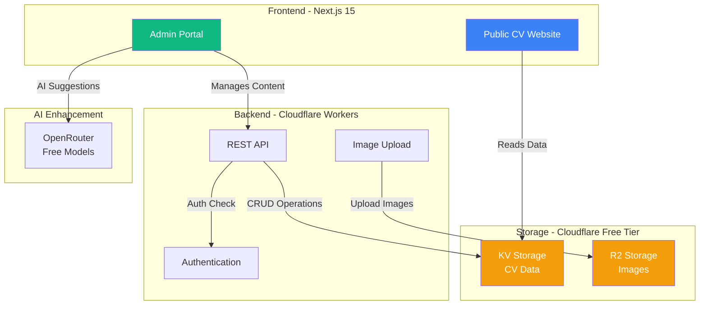
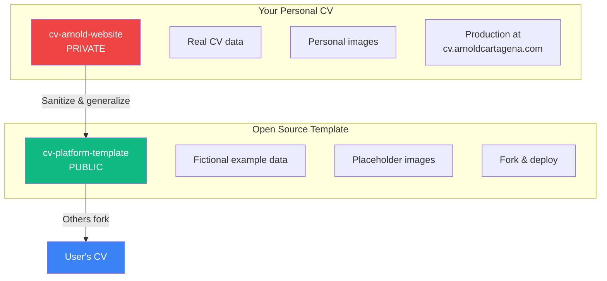

# 🚀 CV Platform - Pitch Deck

**Your Professional CV. Fully Customizable. Deploy in Minutes.**

---

## 💡 The Problem

**Existing CV solutions are limiting:**

- ❌ LinkedIn - Not customizable, cluttered, no control
- ❌ PDF Resume - Static, outdated quickly, hard to share
- ❌ Personal websites - Time-consuming to build, hard to maintain
- ❌ CV builders - Monthly fees, limited features, vendor lock-in

**We need:** A beautiful, customizable CV website that **anyone can deploy for free**.

---

## ✨ The Solution

**An open-source CV platform that:**

✅ **Looks professional** - Modern design, multiple themes
✅ **Easy to manage** - Admin portal for editing (no code needed)
✅ **Free to deploy** - Cloudflare free tier (globally distributed)
✅ **Fully yours** - Own your data, own your domain
✅ **AI-powered** - Enhance content with AI suggestions
✅ **Extensible** - Add custom sections (projects, publications)

---

## 🎯 Who Is This For?

**Primary Users:**

- 👨‍💼 Professionals seeking jobs/clients
- 👩‍💻 Developers showcasing portfolios
- 🎓 Academics sharing publications
- 🎨 Creatives displaying work

**How They Use It:**

1. **Fork** the template repository
2. **Configure** using the setup wizard
3. **Customize** content via admin portal
4. **Deploy** to Cloudflare (free)
5. **Share** their personal domain

---

## 🏗️ Architecture Overview

---

## 🎨 Key Features

### **1. Admin CMS Portal** 🖥️

**Triple Authentication:**

- 🔗 Magic link (email-based, easiest)
- 🔐 Google OAuth (optional)
- 🔑 Admin password (fallback)

**Content Management:**

- ✏️ Edit all CV sections (Personal Info, Experience, Skills, etc.)
- 📸 Upload images (profile, logos, certificates)
- 🎨 Switch themes with live preview
- 👁️ Preview before publishing
- 💾 Save drafts, publish when ready

**Data Export:**

- 📄 Export as PDF (for traditional applications)
- 💾 Export as JSON (backup/migration)
- 🔄 Import from JSON (restore/update)

---

### **2. Beautiful Frontend** 🌟

**Sections:**

- 👤 Hero with photo and bio
- 💼 Experience timeline (interactive)
- 🛠️ Skills matrix (visual)
- 🏆 Certifications & achievements
- 🎓 Education
- 📧 Contact form with integrations

**Design:**

- 🎨 Multiple themes (light, dark, custom)
- 📱 Fully responsive (mobile-first)
- ♿ WCAG AA accessibility
- ⚡ Lightning fast (<2s load time)

---

### **3. AI-Powered Enhancement** 🤖

**Using Free OpenRouter Models:**

- ✍️ Rewrite sections (professional/casual/concise tones)
- 💡 Generate achievement bullet points
- 📝 Improve grammar and clarity
- 🎯 SEO optimization suggestions
- 🔍 Suggest skills based on experience

**Models Available:**

- Meta LLaMA 3.2 (3B)
- Google Gemma 2 (9B)
- Mistral 7B

---

### **4. Setup Wizard** 🧙

**First-time configuration in 5 minutes:**

**Example Data Option:**

- Start with realistic placeholder CV (Jane Doe)
- Edit and customize to your needs
- Or start completely blank

---

## 🔧 Technology Stack

**Frontend:**

- ⚛️ Next.js 15 (App Router, SSG)
- 🎨 Tailwind CSS v4 (Design tokens)
- 📝 TypeScript (Strict mode)
- ✅ Zod (Runtime validation)

**Backend:**

- ☁️ Cloudflare Workers (Serverless)
- 🗄️ Cloudflare KV (Key-value storage)
- 📦 Cloudflare R2 (Object storage)
- 🔐 Session management

**DevOps:**

- 🚀 Cloudflare Pages (Deployment)
- 🧪 Vitest (Testing, >80% coverage)
- 🤖 GitHub Actions (CI/CD)
- 📊 TaskMaster AI (Project management)

---

## 💰 Cost Analysis

**Cloudflare Free Tier:**

- ✅ 100,000 requests/day (Workers)
- ✅ 100k reads/day, 1k writes/day (KV)
- ✅ 10GB storage (R2 images)
- ✅ Unlimited bandwidth (Pages)
- ✅ Free SSL certificates
- ✅ Global CDN (300+ cities)

**Total Monthly Cost: $0** 🎉

Perfect for personal CV sites with moderate traffic.

---

## 📦 Two-Repository Strategy

**Strategy:**

1. Build your personal CV (private repo)
2. Create clean template (public repo)
3. Others fork template and customize
4. Everyone has their own deployment

---

## 🗺️ Roadmap

### **Phase 1: Foundation** ✅ (95% Complete)

- ✅ Next.js setup with TypeScript
- ✅ Design system and themes
- ✅ Data layer with Zod validation
- 🔄 KV storage adapter (in review)

### **Phase 2: Admin Core** 🎯 (Next Up)

- Setup wizard with example data
- Image management (R2)
- Configuration system
- Admin CMS portal

### **Phase 3: Frontend** 📅 (Weeks 6-8)

- Header with navigation
- Hero and experience sections
- Skills matrix and contact form

### **Phase 4: Deployment** 🚀 (Weeks 9-10)

- Cloudflare Workers API
- Production deployment
- Complete documentation

### **Phase 5: Enhancement** ✨ (Weeks 11-12)

- Performance optimization
- Theme framework
- AI content features

### **Phase 6: Open Source** 🌍 (Week 13)

- Create template repository
- Final documentation
- Public launch

---

## 🎯 Success Metrics

**For You:**

- ✅ Professional online presence
- ✅ Easy content updates (no code)
- ✅ Modern, fast, accessible CV
- ✅ Full control and ownership

**For the Community:**

- 🎯 100+ GitHub stars in first month
- 🎯 50+ forks (others using it)
- 🎯 Active community contributions
- 🎯 Featured on "Show HN" / Product Hunt

**Technical Excellence:**

- 🎯 Lighthouse score >95
- 🎯 Test coverage >80%
- 🎯 Load time <2 seconds
- 🎯 Zero runtime errors

---

## 🚀 Why This Will Succeed

**1. Real Need:** Everyone needs a CV, few have good websites

**2. Free & Open:** No vendor lock-in, no monthly fees

**3. Easy to Use:** Non-technical people can deploy

**4. Modern Stack:** Latest tech, best practices, scalable

**5. Extensible:** Themes, custom sections, AI features

**6. Community:** Open source = contributions + improvements

---

## 💪 Competitive Advantage

| Feature           | This Platform | LinkedIn       | Resume Builders | Custom Site |
| ----------------- | ------------- | -------------- | --------------- | ----------- |
| **Cost**          | Free ✅       | Free (limited) | $10-30/mo ❌    | $5-50/mo ❌ |
| **Customization** | Full ✅       | None ❌        | Limited ⚠️      | Full ✅     |
| **AI Features**   | Yes ✅        | Basic ⚠️       | Some ⚠️         | No ❌       |
| **Own Domain**    | Yes ✅        | No ❌          | Sometimes ⚠️    | Yes ✅      |
| **Easy Setup**    | 5 min ✅      | N/A            | 10 min ✅       | Hours ❌    |
| **No Coding**     | Yes ✅        | Yes ✅         | Yes ✅          | No ❌       |
| **Open Source**   | Yes ✅        | No ❌          | No ❌           | N/A         |

---

## 🎬 Demo Flow

**Setup (5 minutes):**

1. Fork template → Click "Use this template"
2. Run setup wizard → Configure auth, choose theme
3. Start with example data → Pre-populated CV
4. Deploy to Cloudflare → One-click deployment

**Daily Use:**

1. Login to admin portal → Magic link to email
2. Edit experience section → Add new job
3. Preview changes → See before publishing
4. Publish → Live on your domain instantly

**AI Enhancement:**

1. Click "Improve with AI" on summary
2. Choose tone (professional)
3. Review suggestion → Before/after comparison
4. Accept → Updated instantly

---

## 📈 Future Enhancements

**V2 Features (Post-Launch):**

- 📊 Analytics dashboard (page views, visitors)
- 🔗 LinkedIn data import
- 📱 Native mobile app (PWA)
- 🌐 Multi-language support
- 🎨 Theme marketplace (community themes)
- 🧩 Plugin system (custom integrations)
- 📧 Email newsletter integration
- 💬 Testimonials section
- 📊 Skills endorsements

---

## 🤝 Open Source Strategy

**License:** MIT (most permissive)

**Community Building:**

- 📚 Comprehensive documentation
- 🎥 Video tutorials
- 💬 Discord community
- 🐛 Issue templates
- 🎯 Good first issues for contributors
- 🏆 Contributor recognition

**Marketing:**

- 🗣️ Hacker News launch
- 🚀 Product Hunt submission
- 📝 Dev.to blog post
- 🐦 Twitter thread
- 📺 YouTube demo

---

## 💎 Value Proposition

### **For You:**

> "A professional CV website that showcases my technical excellence while serving as a
> portfolio piece demonstrating modern web development practices."

### **For Others:**

> "Deploy your beautiful, customizable CV website in 5 minutes. No coding. No monthly
> fees. Fully yours."

---

## ✅ Next Steps

**Week 1:**

- ✅ Finish KV adapter (PR in review)
- 🎯 Start setup wizard implementation
- 📝 Document admin portal architecture

**Week 2:**

- 🎯 Build image management (R2)
- 🎯 Implement configuration system
- 📝 Create implementation docs

**Week 3-4:**

- 🎯 Build admin CMS portal
- 🎯 Implement authentication
- 🎯 Add draft/publish workflow

**Timeline:** 12-13 weeks to public launch

---

## 🎉 Conclusion

This is more than a CV website.

It's a demonstration of:

- ✨ Technical excellence
- 🛠️ Modern architecture
- 🌍 Open source contribution
- 📚 Enterprise-grade practices
- 🚀 Deployment expertise

**Personal Impact:**

- Professional online presence
- Portfolio showcase
- Learning project
- Community contribution

**Community Impact:**

- Help others create professional CVs
- Open source contribution
- Modern web development example

---

Let's build something amazing! 🚀

---

Built with ❤️ using Next.js 15, TypeScript, Cloudflare, and TaskMaster AI
